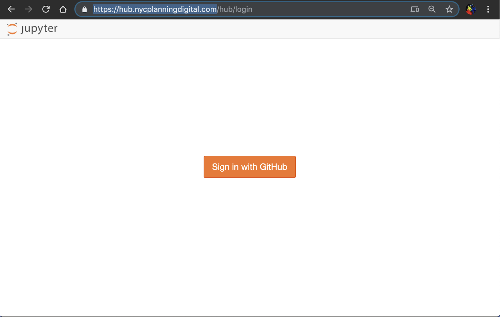
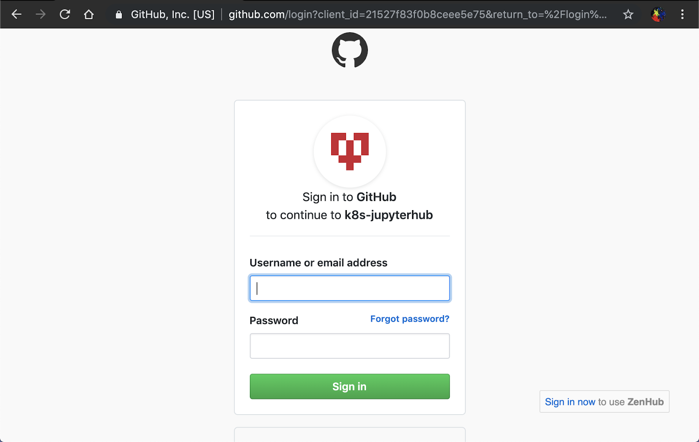
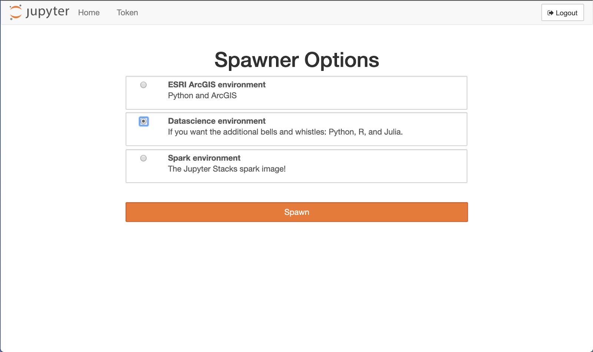
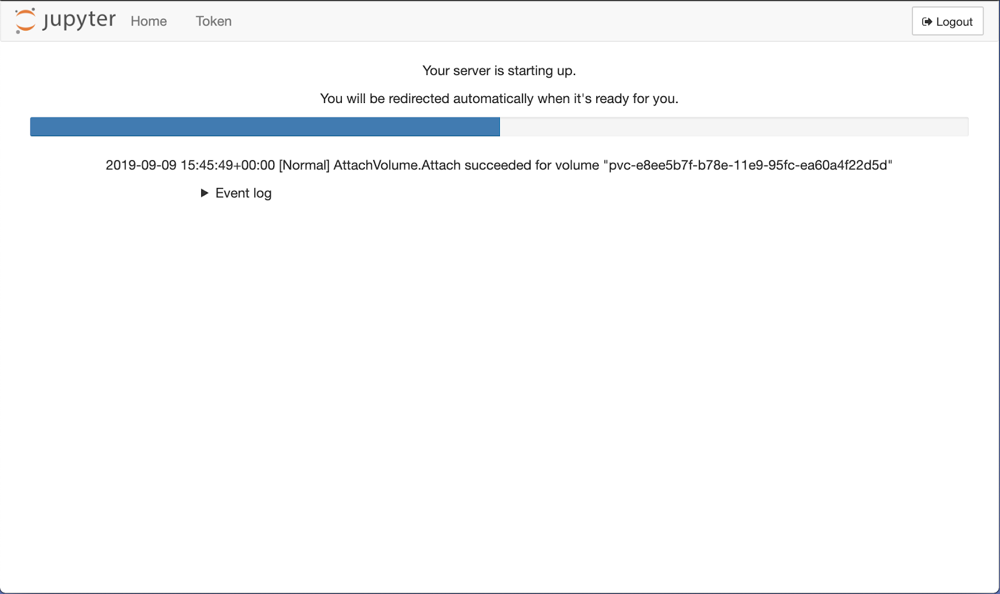
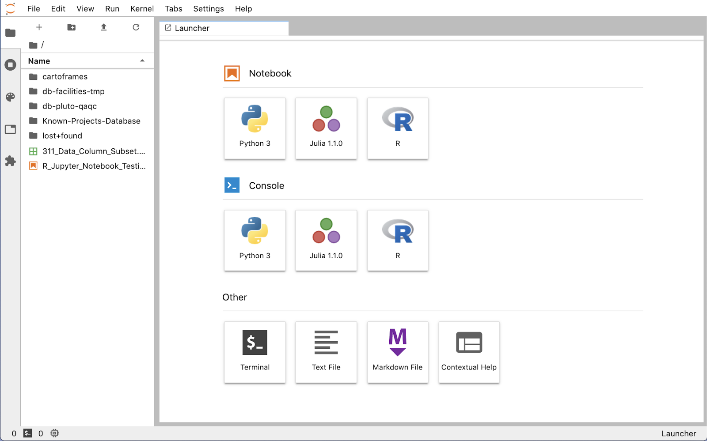
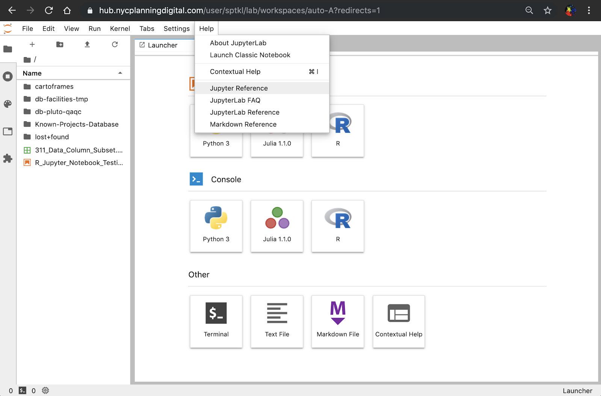

# demo-notebooks
A repo for demo notebooks (both python and r)

## Instructions for accessing Jupyterhub
1. Navigate to __https://hub.nycplanningdigital.com__ using a browser of your choice.

2. Click sign in with github and input your login info

3. Then pick your computing environment and click Spwan (Highly recommend the Datascience environment, which offers both Python and R. Also note the ESRI ArcGIS environment does not support Arcpy)

4. You might have to wait a little bit while Jupyterhub is setting up the environment for you. Good news is, as long as you don’t turn off your server, you only need to do this once.

5. Once the spawning process is done, you will arrive at the launcher page

6. If you have any questions about Jupyter, click help>JupyterLab reference or FAQ

## Quick references
* [File upload](https://youtu.be/1bd2QHqQSH4)
* [File download](https://youtu.be/Wl7Ozl6rMcc)
* [Renaming files](https://youtu.be/y3xzXelypjs)